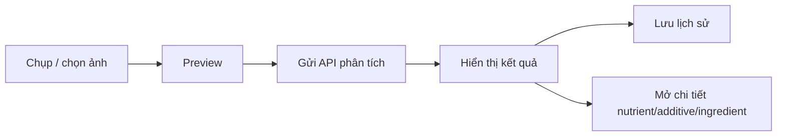

# NutriQuor


NutriQuor là ứng dụng iOS hỗ trợ người dùng phân tích nhãn thực phẩm bằng hình ảnh. Ứng dụng cho phép chụp hoặc chọn ảnh sản phẩm, gửi ảnh đến API để trích xuất thành phần, phụ gia và giá trị dinh dưỡng, sau đó hiển thị kết quả theo giao diện hiện đại, dễ đọc và có thể tra cứu chi tiết từng chất.

## Tính Năng Chính

- Chụp ảnh hoặc chọn ảnh nhãn sản phẩm từ thư viện.
- Gửi ảnh đến API phân tích sản phẩm.
- Hiển thị tên sản phẩm, thành phần, phụ gia, dinh dưỡng, cảnh báo, xuất xứ và thông tin nhà sản xuất.
- Bấm vào nutrient, additive hoặc ingredient để mở màn hình chi tiết tri thức nếu API trả về ID.
- Tìm kiếm và xem chi tiết thành phần, phụ gia, chất dinh dưỡng.
- Lưu lịch sử phân tích theo người dùng.
- Đăng nhập, đăng ký, lưu token và refresh token.
- Giao diện SwiftUI hiện đại theo phong cách Bento Grid, glassmorphism, hỗ trợ light/dark mode.

## Tech Stack

- **Language:** Swift
- **UI:** SwiftUI
- **Architecture:** MVVM
- **Concurrency:** async/await
- **Networking:** URLSession, REST API
- **Auth:** Bearer Token, Refresh Token
- **Local Storage:** UserDefaults
- **Media:** AVFoundation Camera, Image Picker

## Kiến Trúc

```text
NutriQuor/
├── API/                 # Tạo URLRequest cho backend
├── Core/
│   ├── Network/         # APIClient, AuthInterceptor
│   ├── Services/        # Business/API services
│   └── UI/Components/   # Component SwiftUI tái sử dụng
├── Features/            # Home, Search, Scan, History, Auth, Settings
├── Models/              # Domain models, DTOs
├── ViewModels/          # State và logic cho UI
├── Storages/            # Lưu lịch sử phân tích
└── Utilities/           # Helpers, extensions, enums
```

## Luồng Chính



## API

Base URL được cấu hình trong `NutriQuor/AppConfig.swift`.

```swift
let devBaseURL = "https://api.dvxuanbac.com"
```

Các nhóm API chính:

- Auth: đăng nhập, đăng ký, refresh token.
- Product Extract: upload ảnh và nhận dữ liệu phân tích.
- Search Detail: lấy thông tin chi tiết của nutrient, additive, ingredient.
- History/Product: lưu và hiển thị lịch sử phân tích.

## Cách Chạy

1. Mở `NutriQuor.xcodeproj` bằng Xcode.
2. Chọn scheme `NutriQuor 1`.
3. Kiểm tra `AppConfig.swift` trỏ đúng backend.
4. Build và chạy trên iOS Simulator hoặc thiết bị thật.

Build bằng terminal:

```bash
DEVELOPER_DIR=/Applications/Xcode.app/Contents/Developer \
xcodebuild \
  -project NutriQuor.xcodeproj \
  -scheme "NutriQuor 1" \
  -configuration Debug \
  -destination generic/platform=iOS \
  CODE_SIGNING_ALLOWED=NO \
  build
```

## Điểm Nổi Bật

- Tách layer rõ ràng theo MVVM.
- API client dùng chung, có validate response và xử lý token.
- Decoder linh hoạt với dữ liệu API thay đổi, bao gồm trường hợp item không có ID.
- Giao diện được component hóa, dễ bảo trì và mở rộng.
- Có luồng sản phẩm thực tế: scan, analyze, history, search detail.

